```{r setup, include=FALSE}
knitr::opts_chunk$set(echo = TRUE)
knitr::knit_engines$set(python = './venv/bin/python')
```

### Introduction

In this project we try to build a real time class attendance tracker. This is built as an application of facial detection and recognition. We discuss some algorithms from literature that tackle these problems and use deep learning based embeddings to detect and identify faces. We will use open source tools to make implementation challenges and video processing easier. These tools have been discussed in the section 'Runtime Environment' towards the end.

Next we discuss the how the system is designed and managed.

## Modeling attendance

The problem of marking a student as present or absent can be broken down as follows:

1. Capture a frame in video stream of class
2. Detect and recognize faces in the frame from known faces of students in class
3. IF sufficient frames detect a person's face, mark their attendance as present.

This can be seen as a binomial problem with success being the student's attendance correctly recorded and failure being incorrectly recorded. Each trial in this distribution is a Bernoulli event of frame detection being correct which has success probaility 'p' as the accuracy of the model being used to detect and recognize face in the frame. 

If we say that total 'N' frames are processed, then we can define attendance as :
```
if person A is detected in > d% of N frames:
		Mark them present
Else:
		Mark them absent
```

Thus,if 1000 frames are processed and, d = 10, then if person A is detected in 101 frames they are marked present, else absent. By this approach of modeling entire process as a Binomial distribution the probability of a student's attendance being incorrectly marked becomes extremely low.


For example, if d = 10%, then absent is recorded if 90% or more frames fail to detect.

Say K = Ceil(0.9N), then Probability(Incorrect attendance) => Trial fails K or more times.

Thus, P(Incorrect attendance) = $\sum_{i = K}^{N} C^N_i * p^{N-i}  (1-p)^i$

If d = 0, K = N, i.e present marked if even 1 frame detects attendance and then:

```
Probability(Incorrect attendance) = (1-p)^N
```

Say p = 50%, which is a very low classifier accuracy, and N = 100 frames are processed, then

```
Probability(Incorrect attendance) = 7.89 * 10^-31 
```

So even lower accurate models can also give great results but false positives are bad. We overcome that problem by ensuring that d% of frames are detecting a student. The d% should be high enough to eliminate false positives and false negatives.

Let us now focus on each frame processing. Each frame will involve face detection, extraction and recognition.

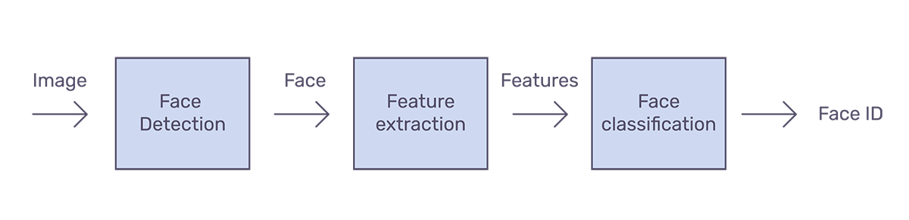

## Face detection

Face detection is a classical problem which has many established algorithms. We will consider a few classical ones and few more recent deep learning based approaches. For our use case, we want to pick an approach that is accurate but also fast enough to be executed in real time.

For our project, we have tested the following face recognition algorithms:

1. OpenCV based Haar Cascades
2. Histogram of Gradient + SVM
3. Histogram of Gradient + CNN

### 1) Open CV Haar Cascade

This method revolutionized face detection on devices. The method is blazing fast (e.g. on Macbook pro 15inc we have 38ms average frame per second processing) but less accurate (as low as 85% on local image set) as many false positives were detected while its implementation. It is a machine learning based approach where a cascade function is trained from a lot of positive and negative images. It is then used to detect objects in other images.

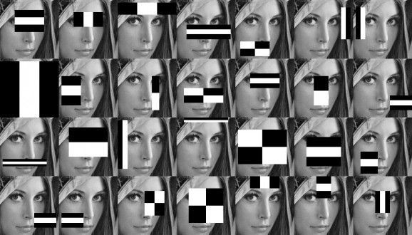

Haar Cascade being legacy algorithm require some advanced detection techniques with higher accuracy. To deal with lower accuracy and false positives of Haar, we will use HOG based SVM and CNN models provided by DLib open source tool.

### 2) Histogram of gradients (HOG)

To find HOG of a frame in an image, we’ll start by converting our colored image to gray scale because we don’t need color data to find gradients for our use case. Lets start with the image below of Will Ferrel.
{width=40%}

Then we’ll look at every single pixel in our image one at a time. For every single pixel, we want to look at the pixels that directly surrounding it to compute gradient. Our goal is to figure out how dark the current pixel is compared to the pixels directly surrounding it. Then we want to draw an arrow showing in which direction the image is getting darker. Example in images below.


| Eye subframe zoomed | Gradient at the center |
|:--------------:|:------------------------:|
| 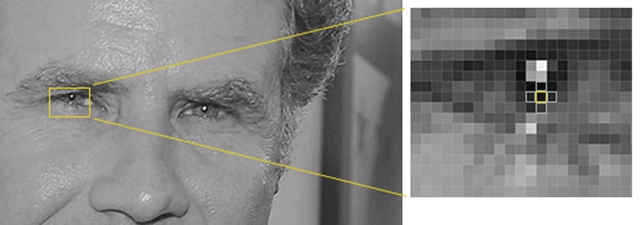{width=60%} | 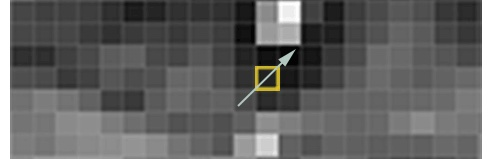{width=50%} |

If we repeat this process for every single pixel in the image, we end up with every pixel being replaced by an arrow. These arrows are called gradients and they show the flow from light to dark across the entire image as below.

| Original eye subframe | HOG Transformation matrix |
|:--------------:|:------------------------:|
| 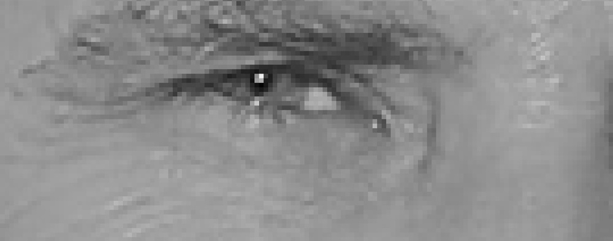{width=50%} | 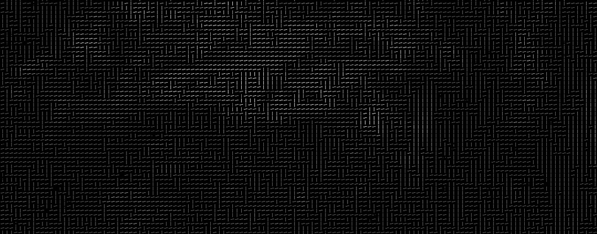{width=50%} |

The end result is we turn the original image into a very simple representation that captures the basic structure of a face in a simple way.

| Complete eye zone | HOG Transformation |
|:--------------:|:------------------------:|
| 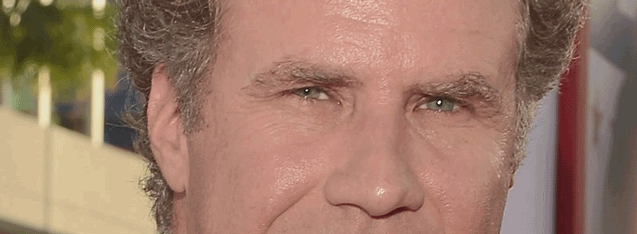{width=50%} | 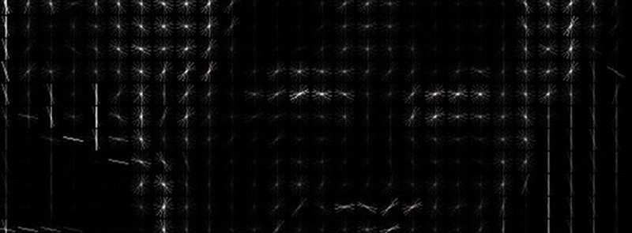{width=50%} |

To find faces in this HOG image, all we have to do is find the part of our image that looks the most similar to a known HOG pattern that was extracted from a bunch of other training faces:

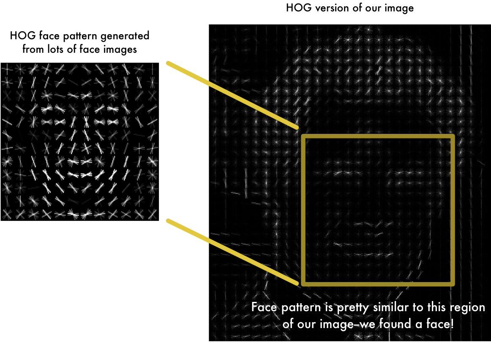{width=60%}

| 68 Face landmarks | Observed results |
|:--------------:|:------------------------:|
| {width=50%} | {width=50%} |


To figure out which subframe of this HOG representation is a face, we can use 2 models which are pretrained and available in opensource library dlib. These are:

1. Default SVM approach which is trained on ibug dataset of 4000+ images to detect the face landmarks. The basic idea is we will come up with 68 specific points (called landmarks) that exist on every face — the top of the chin, the outside edge of each eye, the inner edge of each eyebrow, etc.
2. Resnet34 based CNN which is trained on 3 million images. This is very powerful but consequently slow.

On Macbook pro machine the SVM based classifier takes 383ms per frame on average and CNN based approach takes 1890ms on average per frame. Let us write some code to compare results.

Below script will generate a face rectangle marked on the input image using HOG+SVM Approach.

```{python, code=xfun::read_utf8('find_faces_in_picture_hog.py')}
```

Below script will generate a face rectangle marked on the input image using HOG+CNN Approach.

```{python, code=xfun::read_utf8('find_faces_in_picture_cnn.py')}
```

We can execute these as follows:

```{bash}
# The problem assumes a virtual runtime environment as described
# in section 'Runtime environment' later.
source ./venv/bin/activate
python find_faces_in_picture_cnn.py
```

The results of running the above code on 2 images is as below:

| Original Image | Faces detected with HOG |
|:--------------:|:------------------------:|
| 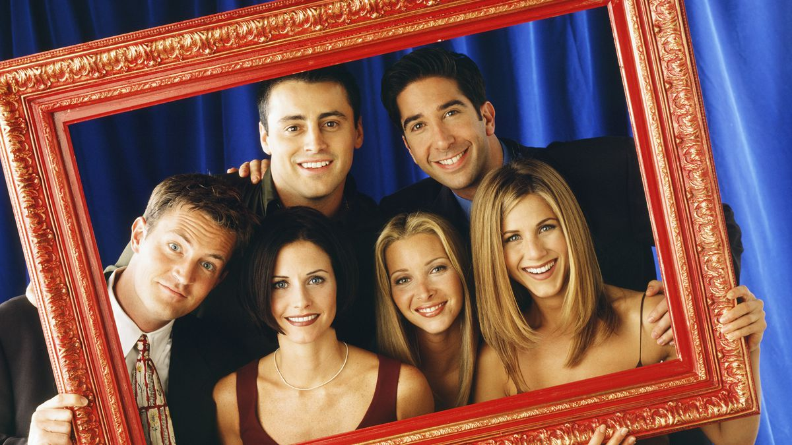{width=50%} | 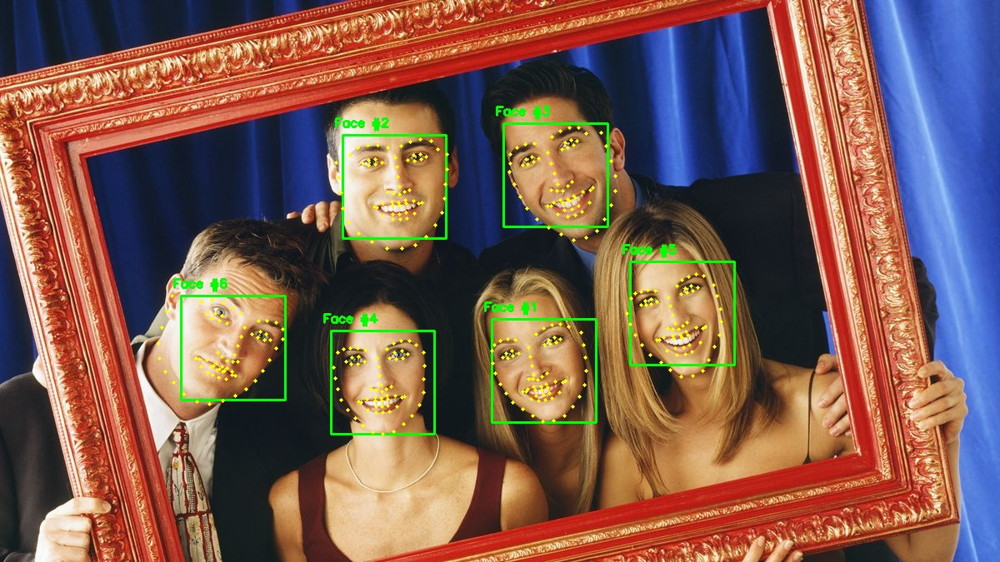{width=50%} |

| Faces with HOG+SVM | Faces with HOG+CNN |
|:--------------:|:------------------------:|
| {width=50%} | 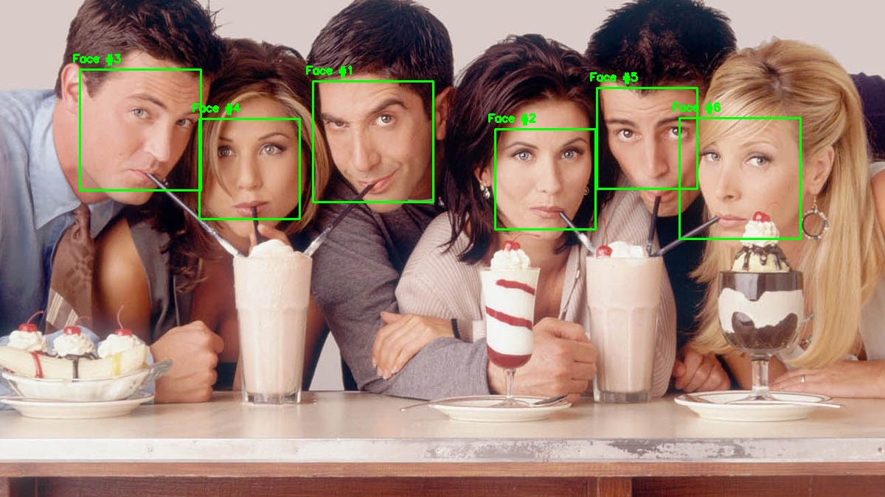{width=50%} |

The above results show that SVM based approach is lower accurate when faces are turned but as proposed in the modeling section of attendance on multiple frames, due to lower time processing of SVM approach we will use that in our attendance tracker.

## Face recognition

Now that face detection has been done, we can easily extract the subframe of the faces and for each frame generate a feature vector. For our use case we will use Facenet based algorithms 128 dimension vector for each face subframe.

Similarly, we collect for each student, a set of images for their faces and generate the 128 dimensional encodings for each student and create our training model. This approach is preferable as it is simple and works really well in realtime.

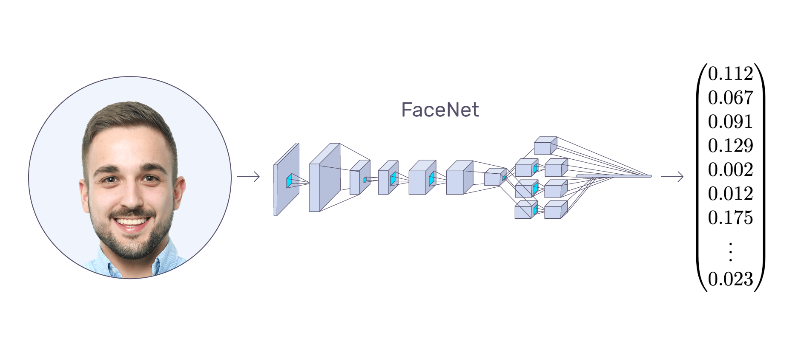
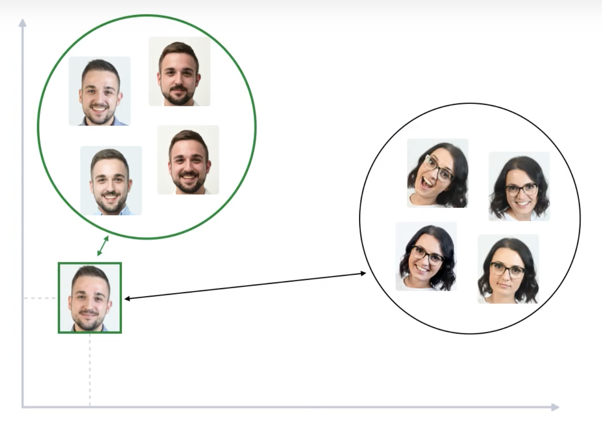

With the training data at hand we have a 128 dimensional space and we can use K-NN based approach or even simple euclidean distance comparisons with trained model encodings to decide which person is detected in the facial subframe from previous step.


## Runtime environment

The heart of any applied modern machine learning solution is the infrastructure it is built on and the runtime environment. The tools and technologies used could play a vital role so that same solutions aren't rebuilt from scratch. One of the key learnings for me through this project was this understanding. For this project we use a variety of machine learning and assisting technologies to handle image/video data. Some of the libraries we used are below:

1. Install pyenv and install python 3.8.12 (https://github.com/pyenv/pyenv for your environment)
  
    a. brew install pyenv
	  b. echo 'eval "$(pyenv init --path)"' >> ~/.zprofile
	  c. echo 'eval "$(pyenv init -)"' >> ~/.zshrc
	
2. Make project directory and setup venv
	a. mkdir ~/Project
	b. cd Project
	c. pyenv local 3.8.12
	d. python -m venv venv
	e. source ./venv/bin/activate
	f. deactivate (when done)
	
3. Install tools to build and setup tools:
	
	a. brew install cmake
	b. pip install numpy
	c. pip install opencv-contrib-python
	d. pip install dlib
	e. pip install --upgrade imutils
	f. pip install face_recognition
	g. pip install matplotlib
	
The code and results are based on this runtime environment setup successfully and configured.

## Demo scripts

Next we present some demo scripts for verifying the above findings.

### Detect faces with Haar Cascade

```{python, code=xfun::read_utf8('find_faces_in_video_haar_cascades.py')}
```

### Detect faces with HOG+SVM

```{python, code=xfun::read_utf8('find_faces_in_video_hog.py')}
```

### Detect faces with HOG+CNN

```{python, code=xfun::read_utf8('find_faces_in_video_cnn.py')}
```

### Real time face recognition and attendance marker

Based on above principles here is the script for the real time facial detection. The training is clubbed in this script for simplicity of demo and understanding. However, on larger scale training on data of class images can be migrated to a separate script for batch processing and saving for later usage.

```{python, code=xfun::read_utf8('attendance_recorder.py')}
```

The above code was demonstrated in class and is consolidated here for simplicity of reading.

## Other resources & references

The project is hosted at https://github.com/sprihap/Projects and also contains other scripts used for generating and comparing results we have discussed. We have used extensively several opensource project resources and want to acknowlege their immense contribution to learning:

1. OpenCV (https://opencv.org/)
2. Dlib (http://dlib.net/)
3. Face recognition, Numpy, SciKit python packages
4. https://arsfutura.com/magazine/face-recognition-with-facenet-and-mtcnn/